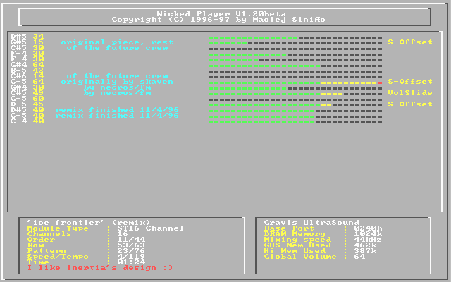

# wickedplayer
My old MOD/S3M player (GUS only)

Created back in 1996/97, my first big C application (was pure asm guy back then).
Plays MOD & S3M files, supports Gravis Ultrasound only.
DOS only, but actually seems to run decently under DOSBox (included binaries).
It was originally built using WATCOM C & PMODE/W, so probably almost impossible to compile with modern compilers.  
Uploading here mostly so it's preserved for myself (it's my only source from that era that survived until today).

